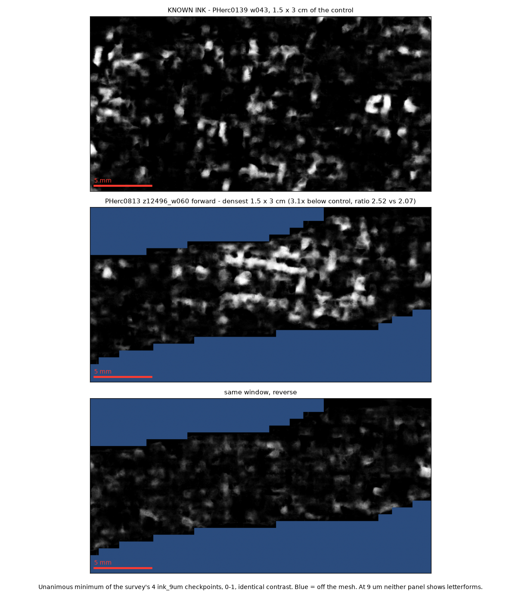
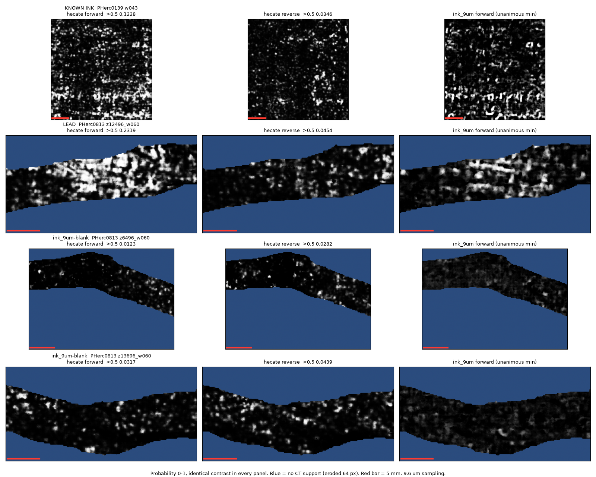
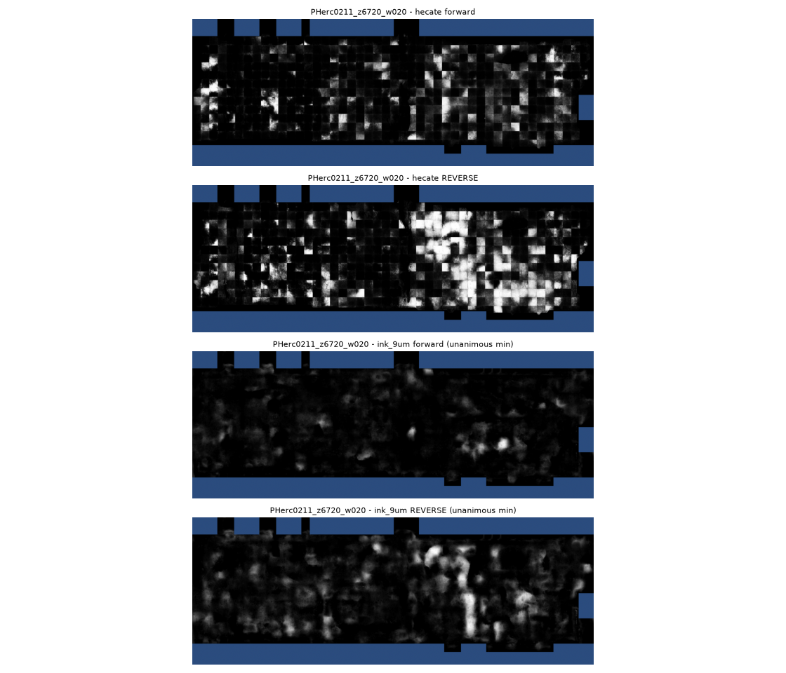
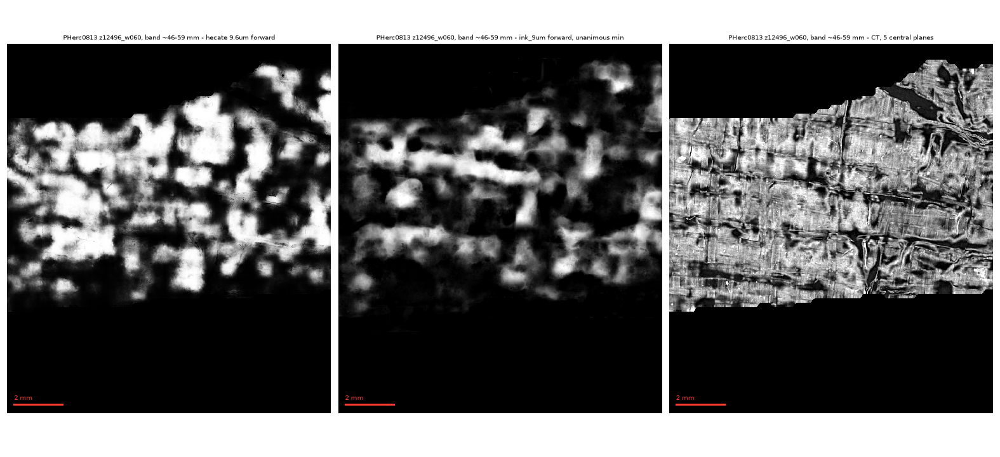
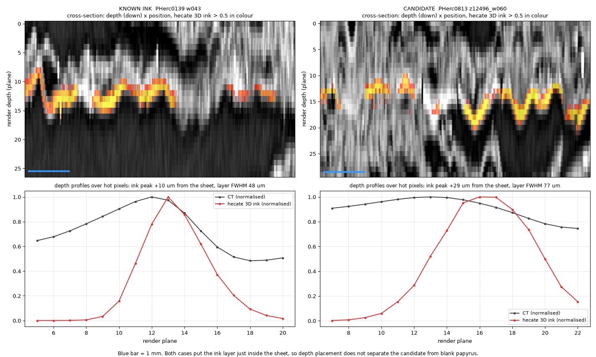

# Ink-surveying the public eligible-scroll corpus

**1,667 cm² of the best-aligned public First Letters surface, 301 meshes across all eight corpus
scrolls, run through `ink_9um` against a known-ink control. No letters seen.**

**Being re-run, now with two models.** On 16 September I found a scoring bug that affects every
score-derived number in the earlier versions of this page, and fixing it overturned the page's headline
claim. Every mesh is being re-rendered and re-scored, and each render is now also scored by the team's
new **hecate 9.6 um** model (below). 270 of 327 meshes re-scored with `ink_9um`, 100 of those with hecate.

## Correction — 16 September 2026 (read this first)

Four things were wrong. I found them by drawing the strongest flagged region next to the known-ink
control at the same scale, which the earlier write-up never did.

### 1. The coverage mask dropped blank papyrus

`score()` took "covered" pixels *after* the label-smoothing rescale, which maps every confident
no-ink value (≤ 0.25) to 0. So confidently blank papyrus left the denominator, and the 64 px
erosion then cut square holes around it. Coverage is now taken from the raw model output.

| | area scored | >0.75 | confidence ratio |
|---|---:|---:|---:|
| control PHerc0139 w043, old mask | 62.5% | 0.04211 | 2.23 |
| **control, fixed** | **100%** | **0.04269** | **2.07** |
| PHerc0813_z12496_w060 forward, old mask | 5.91 cm² | 0.01598 | 2.44 |
| **same, fixed** | **6.79 cm²** | **0.01392** | **2.52** |

The error does not run in one direction. On the 55 prediction sets still on disk, fixing the mask
moved high-confidence coverage by **0.73× to 2.25×**, and some ratios fell by more than 40% (12.35 →
6.81). So a mesh that was *not* flagged under the old mask is not known to be clean. Predictions for
unflagged meshes were deleted after scoring, so they cannot be re-scored in place. **All meshes are
being re-rendered and re-scored with the fix, and every prediction is now kept** (`--rescore
--keep-all`).

### 2. The control was on a different basis

Survey meshes are scored at 4 checkpoints; they were compared against the control's
**8-checkpoint** figure (0.03694). "Unanimous" over 4 is a weaker test than over 8. The control is
now scored by the same function, at the same 4 checkpoints (0.04269).

### 3. The "four-check rule" is withdrawn

The earlier page proposed rejecting candidates on **row periodicity at 4–5 mm** and **stroke-sized
components (0.3–2 mm²)**. Neither check was run on the known-ink control. Run now (fixed mask,
[`scripts/screen_flagged.py`](scripts/screen_flagged.py), scroll-vertical axis read from each
mesh's `z.tif`):

| | row pitch, whole region | row pitch, three 1 cm strips | p90 component | area in 0.3–2 mm² components |
|---|---|---|---:|---:|
| **known ink**, PHerc0139 w043 | 5.00 mm @ 1.62× | 2.73 @ 1.68 · 4.29 @ 2.12 · 3.00 @ 2.39 | **0.094 mm²** | 71% |
| PHerc0813_z12496_w060 fwd | 3.07 mm @ 1.16× | 2.56 @ 1.21 · 3.84 @ 1.29 · 2.56 @ 1.68 | 0.006 mm² | 50% |

- **Stroke size:** known ink's p90 component is 0.094 mm², under the 0.3 mm² floor, so this check
  rejects real ink under `ink_9um`. The share of area at stroke size (71% vs 50%) does not separate
  the two either.
- **Row pitch:** on known ink the strongest pitch wanders from 2.7 to 5.0 mm depending on where you
  look, so a 4–5 mm window rejects real ink too. Prominence overlaps at 1.68×. And the
  PHerc0813 mesh is only 1.5 cm tall, which leaves about four frequency bins between 2.5 and 10 mm.
  Its "3.07 mm" could hardly have come out any other way.

**Neither check can reject a candidate.** What remains of the rule is coverage and confidence ratio
against a matched control, then a look.

### 4. PHerc0813_z12496_w060 is unresolved, not "not ink"



The earlier page called this region a false positive, "plausibly kollesis", on the strength of
checks 3 and 4 and of how it looks. Checks 3 and 4 are withdrawn above. And at 9 µm, `ink_9um` on
**known ink** shows no letterforms or rows either, so the picture cannot decide it.

What is measured, with the fixed mask:

| direction | >0.5 | >0.75 | ratio | vs control |
|---|---:|---:|---:|---:|
| **forward** | 0.03503 | **0.01392** | **2.52** | **3.1×** |
| reverse | 0.00400 | 0.00075 | 5.35 | 57.1× |

It is still the strongest region the survey has found on an eligible scroll: 3.1× below known ink,
a confidence ratio close to the control's, and one-sided (forward 18.6× reverse), which is what ink
on one face of a sheet would look like. That makes it **a weak lead, not a find and not a known
false positive.** A model that resolves letters, or someone who reads 9 µm CT for ink and kollesis,
could settle it. I cannot, from these outputs.

The other seven flagged regions sit **15–124× below control** with the fixed mask, and fail on
coverage alone ([`data/screen_flagged.json`](data/screen_flagged.json)).

## A second model: hecate 9.6 um on the eligible corpus (17 September)

The team published [`scrollprize/hecate`](https://huggingface.co/scrollprize/hecate) on 15 September,
including a **9.6 um** checkpoint distilled from their 2.4 um canonical detector and trained partly on
native coarse scans. Nobody had run it on the First Letters scrolls. It is a genuinely independent
second opinion on this survey's strongest region, so the survey now scores every render with **both**
models.

Method: each render is resampled to 9.6 um in all three axes (the model card requires it; the script
does not resample), run forward and reverse, stride 64, batch 16, bf16. Support = CT present in the 16
central planes, eroded 64 px. Checkpoint commit `9cb86e5`, sha256 `809f4f10...fe5d`.

### Calibration, and what a blank mesh looks like

| case | hecate fwd >0.5 | **fwd >0.75** | ratio | rev >0.75 | ink_9um, same window |
|---|---:|---:|---:|---:|---|
| known ink, PHerc0139 w043 | 0.1278 | **0.0685** | 1.87 | 0.0170 | the control |
| **PHerc0813_z12496_w060 (this survey's strongest region)** | 0.2251 | **0.1353** | 1.66 | 0.0183 | 3.1x below control |
| PHerc0813_z6496_w060, ink_9um-blank | 0.0196 | 0.0048 | 4.09 | 0.0161 | 49x below |
| PHerc0813_z13696_w060, ink_9um-blank | 0.0342 | 0.0147 | 2.33 | 0.0202 | 205x below |



hecate separates known ink from ink_9um-blank meshes by 5-14x, its map on the control correlates with
ink_9um's at r = 0.61, and both models show the control's bottom text line.

**Corpus baseline so far** (`data/hecate/corpus_baseline.json`, 100 of 327 meshes scored, run continuing):
median **0.0059**, p90 0.0155, max 0.0234. Those are whole-mesh scores, which is **not a fair
yardstick** for the strongest region: its 0.1353 comes from a window picked because ink_9um was densest
there, and picking the best window inflates any score.

**Fair comparison** ([`scripts/hecate_window_max.py`](scripts/hecate_window_max.py)): give every corpus
mesh the same advantage -- its densest window of the same width, **in either direction**, chosen by
hecate itself -- and score every window, the candidate's included, with one support rule. Snapshot over
149 meshes (18 September, backfill continuing): median 0.0109, p90 0.0250.

| best same-width window | direction | hecate >0.75 |
|---|---|---:|
| **PHerc0813_z12496_w060 (the candidate)** | forward | **0.1107** |
| **PHerc0211_z6720_w020** | reverse | **0.0900** |
| **PHerc0813_z13088_w040** | forward | **0.0635** |
| every other mesh | | at most 0.0405 |

**The candidate is the highest window, but it is not alone.** Two earlier versions of this page
overstated the gap: "5.8x the corpus maximum" compared a picked window with whole-mesh averages, and
"3.3x the best corpus window" counted forward maps only. Both directions are compared because a response on
either face is data; what the direction means physically is measured below. `PHerc0813_z13088_w040` is the mesh directly above
the candidate, one wrap inward, and ink_9um ranks it third of 616 mesh-directions.

### What the direction means: forward is the face that carries text

Every mesh here uses the same orientation ([`scripts/mesh_orientation.py`](scripts/mesh_orientation.py):
a circle fitted through each grid row gives the local centre of curvature, on the core's side). The surface
normal points **toward the core** on all 320 of 320 corpus meshes and on the published
PHerc0139 w043 mesh used as the known-ink control (outward share 0.003). The
control's ink reads **forward**. So on every mesh, forward is the face that carries text on the control.

That gives the direction a physical meaning. The PHerc0813 regions read **forward**, on the text face. The
two PHerc0211 regions below read **reverse**, on the opposite face, which in a roll is usually left blank.
And on ordinary papyrus hecate runs slightly high in reverse: reverse beats forward on
62% of 159 meshes (median ratio 1.18), where
ink_9um shows no such tilt (49% of 320, median 1.00).
So a reverse response is weaker evidence than the same number forward. (An earlier version of this page
said the direction "depends on how that mesh was fitted"; this measurement shows it does not.) Caveat:
PHerc0211_z6720_w020 sits near the core, where the curvature fit is least certain (across its rows, a
median 44% of normals point outward, against 3% for the corpus).

### A second region: PHerc0211_z6720_w020



On a different scroll, in the **reverse** direction, both models agree: hecate reverse reads 0.115 over
the whole 1.96 cm² mesh (forward 0.026), and ink_9um reverse is 5.7x below its control (forward 45x),
fourth of 616 mesh-directions. Both concentrate in the right half. It has not yet been through the
centring, shape and continuity checks the first region has, so it is **a second candidate, not a result**.

Note on the maps: the survey runs hecate at stride 64, where its 0.6 mm tiles do not overlap, so maps
show square blocks (each tile's depth attention settles on a sheet independently). The calibration above
still separates known ink from blank papyrus at this setting; single maps are noisier than at stride 32.

### Why the strong reading is not just "a sheet is centred here"

hecate's hot pixels coincide with a sheet sitting at the render's centre, and a model that merely liked
well-centred papyrus would light up blank meshes too. Binning pixels by sheet centring (central-minus-outer
CT) into pooled quintiles, forward >0.75 (`scripts/hecate_matched.py`, stride 32):

| | q1 (off-sheet) | q2 | q3 | q4 | q5 (well centred) |
|---|---:|---:|---:|---:|---:|
| known ink | 0.024 | 0.040 | 0.053 | 0.069 | 0.103 |
| **strongest region** | **0.078** | **0.113** | **0.137** | **0.174** | **0.253** |
| blank A | 0.0016 | 0.0024 | 0.0026 | 0.0050 | 0.0077 |
| blank B | 0.0070 | 0.0117 | 0.0151 | 0.0159 | 0.0152 |

Centring does modulate every case, and it does not explain the difference.

### What the region actually is: a ~12 mm patch, not a seam, and not letters

Across the full 74 mm mesh the ink_9um hot fraction is one band at mm 47-58 with a sharp onset and ~0
elsewhere, though coverage is 52-70% throughout. Within the band's own (x, y) footprint on the same wrap
(`scripts/lead_continuity.py`; wrap labels on this scroll are a median 2.84 mm apart, so only same-wrap
meshes are comparable, and the column radius is 0.94 mm):

| mesh, wrap w060 | hot fraction in the band's column | mesh-wide ink >0.75 |
|---|---:|---:|
| **z12496 (the region)** | **0.0484** | 0.01392 |
| z11904, ~7 mm below | 0.0103 | 0.00322 |
| z13088, ~7 mm above | 0.0014 | 0.00056 |

CT on well-centred pixels: the sheet inside the band is the same thickness as beside it (~96 um vs 96 and
86 um) but ~20% denser at the peak. A kollesis runs the full height of the roll, so a sheet join should
not fade 5x below and 35x above within 7 mm.



At full resolution the band is 1-2 mm blobs with two ~5 mm horizontal streaks in ink_9um and **no
letterforms** -- but known ink at 9 um shows no letterforms either, so appearance cannot settle it.

**Status.** A localised deposit roughly 12 mm wide and 7 mm tall, on one sheet of an eligible scroll,
that **two independent team ink models flag**, one of them more strongly than known ink. Of 149 meshes scored so far it is the
highest, with two other regions in the same range (above). **It is a candidate location, not a discovery.** Ink, stain and glue are all
still consistent with what is measured here; separating them needs a model that resolves letters or
someone who reads 9 um CT for ink. If that is you, the numbers, scripts and predictions are all here.

### A test that did not separate it: hecate's 3D output

hecate also predicts ink **in 3D**, meant to sit on the middle sheet of the render. Real ink is a thin
layer on one face of the papyrus, so depth placement looked like a way to tell ink from bulk material.
Run on the same volumes ([`scripts/hecate_3d.py`](scripts/hecate_3d.py)), over each case's own hot
pixels, inside the model's evaluated depth window:

| case | ink peak vs CT sheet peak | ink layer FWHM | sheet FWHM | peak probability |
|---|---:|---:|---:|---:|
| **known ink**, PHerc0139 w043 | +10 um | 48 um | 77 um | 0.53 |
| **the candidate** | +29 um | 77 um | 115 um | 0.37 |
| blank A, z6496_w060 | +29 um | 67 um | 96 um | 0.41 |
| blank B, z13696_w060 | +0 um | 67 um | 67 um | 0.44 |



All four place the response in a layer thinner than the sheet, within +-30 um of the CT peak, and the
cross-sections look alike. **So the 3D head does not separate the candidate from blank papyrus, and its
output should not be read as confirmation.** Known ink does respond more strongly at its peak (0.53 vs
0.37), which is a difference of degree, not of placement.

## The survey

Input: [`pscamillo/vesuvius-eligible-meshes`](https://github.com/pscamillo/vesuvius-eligible-meshes)
(MIT) — 340 meshes, 1,935 cm², eight eligible scrolls. Ordered by **measured** mesh-vs-sheet
alignment from
[eligible-mesh-alignment](https://github.com/TAUIL-Abd-Elilah/eligible-mesh-alignment), best
first; the 11 meshes at ≥30° are skipped.

Per mesh: render 31 layers, gate CT support (villa #1254), run **4 `ink_9um` checkpoints × both
directions**, score the **unanimous minimum** at threshold 0.75 over the model's output, eroded
64 px, against the known-ink control PHerc0139 w043 at the same 4 checkpoints.

Coverage before the re-run (pre-fix snapshot, [`data/prefix_badmask/`](data/prefix_badmask/); its
score fields are superseded):

| scroll | meshes | cm² |
|---|---:|---:|
| PHerc0800 | 90 | 478.8 |
| PHerc0211 | 72 | 401.1 |
| PHerc0125 | 60 | 379.9 |
| PHerc0813 | 64 | 356.0 |
| PHerc0257 | 5 | 17.1 |
| PHerc0826 | 3 | 13.2 |
| PHerc0358 | 3 | 11.8 |
| PHerc0268 | 4 | 9.3 |
| **total** | **301** | **1,667.3** |

**On failures.** An earlier pass logged 110 render failures. Their logs show every one was
environmental: 61 DNS outages (`getaddrinfo failed`), 22 processes killed at logoff, the rest
SSL/stall timeouts. Retried on a healthy link, 1 render failure remains, plus 3 surfaces with no CT
support.

## PHerc1447: the three segments a maintainer would not rule out

FrankTheRope flagged row-like banding at 3.5–4 mm in raw meshes `z_dbg_gen_00215/00260/00701`;
Bruniss replied he "would not necessarily say those _arent_ letters/text". Re-scored with the fixed
mask ([`data/pherc1447_flagged_scores.json`](data/pherc1447_flagged_scores.json)):

| segment | >0.75 fwd / rev | ratio fwd / rev | vs control fwd / rev |
|---|---:|---:|---:|
| 00215 | 0.00613 / 0.00563 | 5.72 / 6.20 | 7.0× / 7.6× |
| 00260 | 0.00577 / 0.00489 | 5.22 / 6.32 | 7.4× / 8.7× |
| 00701 | 0.00499 / 0.00473 | 6.21 / 5.93 | 8.6× / 9.0× |

All diffuse, 7–9× below control. **Read this with the geometry**
([eligible-mesh-alignment](https://github.com/TAUIL-Abd-Elilah/eligible-mesh-alignment)): the
published PHerc1447 surfaces sit on nonzero CT a median 46% of the time, and those lying entirely on
CT cut across the sheets at 50–71°. `00260` and `00701` are among them (49.9° and 68.2°). These
surfaces are not a fair test of whether PHerc1447 has text.

## Limitations

- **Every score-derived number is pending the re-run**, except the control, the 8 flagged regions
  and the 3 PHerc1447 segments, which are re-scored above from kept predictions.
- One known-ink control, one 3 × 3 cm crop. Anything calibrated on it is provisional.
- `ink_9um` localises the ink field but does not resolve letters even on training scrolls, so a
  negative is "this model recovered no text", not "there is no ink".
- Bandwidth-bound at ~600 KB/s (~0.41 GB/cm²).
- No discovery is claimed.

## Reproduce

```bash
python scripts/corpus_survey.py --shard 0/2 --rescore --keep-all   # + shard 1/2; resumable
python scripts/corpus_aggregate.py                                  # merge shards, rank
python scripts/screen_flagged.py                                    # checks vs known ink + figure
```

Credits: corpus [@pscamillo](https://github.com/pscamillo); alignment gate
[@flummoxjr](https://github.com/flummoxjr); row-pitch measurements and the fibre-bundle
false-positive mode [@FrankTheRope](https://github.com/FrankTheRope).

MIT · Vesuvius Challenge, September 2026 · AI assistance (Claude) under my direction; I set the
questions, chose the controls, and checked the numbers.
