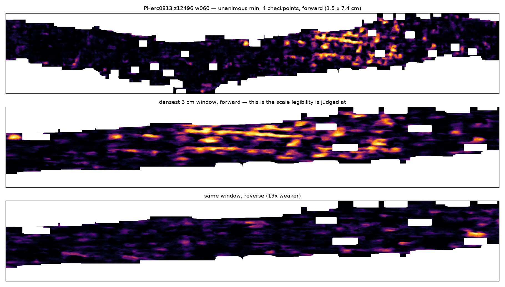

# Ink-surveying the public eligible-scroll corpus — and one false positive worth your time

**237 cm² of the best-aligned public First-Letters surface, ink-surveyed under a
control-calibrated rule. No text. One region passed two of four screens and is not ink — the
write-up of *why* is the useful part.**

Ongoing; numbers below are a snapshot. Data regenerates with `scripts/corpus_aggregate.py`.

## The survey

Input: [`pscamillo/vesuvius-eligible-meshes`](https://github.com/pscamillo/vesuvius-eligible-meshes)
(MIT) — 340 meshes, 1,935 cm², eight eligible scrolls. Ordered by **measured** mesh-vs-sheet
alignment from
[eligible-mesh-alignment](https://github.com/TAUIL-Abd-Elilah/eligible-mesh-alignment), best
first; the 11 meshes at ≥30° are skipped because an oblique surface feeds the model a blend of
sheet and gap and its score means nothing.

Per mesh: render 31 layers, gate CT support (villa #1254), run **4 `ink_9um` checkpoints × both
directions**, score the **unanimous minimum** at threshold 0.75 over coverage eroded 64 px,
against a same-day known-ink control (PHerc0139 w043).

| scroll | meshes | cm² |
|---|---:|---:|
| PHerc0800 | 22 | 119.8 |
| PHerc0813 | 15 | 60.3 |
| PHerc0211 | 15 | 47.8 |
| PHerc0125 | 3 | 7.1 |
| PHerc0358 | 1 | 1.8 |
| **total** | **56** | **236.6** |

Control: `>0.75 = 0.03694`, confidence ratio `2.07`.
Survey: **min 2.3× below control, median 62.5×, max 5,872×**; ratio median **9.48** vs 2.07;
6 meshes with nothing above 0.75 at all. **No text found.**

## The false positive, which is the point

`PHerc0813_z12496_w060` — 5.91 cm², alignment 4.8°, CT support 0.53.

| direction | >0.5 | >0.75 | ratio | vs control |
|---|---:|---:|---:|---:|
| **forward** | 0.03903 | **0.01598** | **2.44** | **2.3×** |
| reverse | 0.00439 | 0.00085 | 5.19 | 43.6× |

Coverage within 2.3× of a known-ink control, a confidence ratio of 2.44 against the control's
2.07, forward 19× stronger than reverse. **On a ratio-plus-coverage rule this is a hit.**

It is not ink:

| screen | result |
|---|---|
| edge artifact | **pass** — hot pixels median 144 px from the coverage edge vs 133 px overall; 10.5% within 64 px against a 25.3% baseline |
| confidence ratio | **pass** — 2.44 vs control 2.07 |
| **row periodicity** | **FAIL** — best peak 3.07 mm at only **1.16×** prominence. Scribal line pitch on PHerc0139/1667 is **4.1–4.9 mm** |
| **stroke morphology** | **FAIL** — 296 components, p90 **0.006 mm²**, largest 2.37 mm². A letter stroke is **0.3–2 mm²** |



Dense irregular blobs in one stretch, no rows, no letterforms, and the same window nearly empty
in reverse. The 3.07 mm periodicity sits on
[scrollscout](https://github.com/FrankTheRope/scrollscout)'s documented fibre-bundle
false-positive mode (~3.3 mm), not on scribal pitch.

**What it costs you to know this:** a crisp response is not an ink response. Dense localised
material is crisp for the same reason ink is — this is very plausibly the *kolleisis juice* at a
sheet join that Bruniss described as material where "ink and it look very similar." A
ratio-vs-control test separates ink from *diffuse* texture; it does not separate ink from dense
material.

### The rule this implies

A region is a candidate only if it passes **all four**:

1. unanimous minimum, 4+ checkpoints, threshold 0.75, coverage eroded 64 px;
2. high-confidence coverage within ~5× of a same-day known-ink control;
3. **row periodicity at 4–5 mm with prominence well above 1.2×** — not merely some peak;
4. **components at stroke scale, 0.3–2 mm²** — not speckle, not one blob;

then **looked at at ≥3 cm** before it is believed. A near-control ratio moves a region up the
queue; it no longer clears it.

## PHerc1447: the three segments a maintainer would not rule out

FrankTheRope flagged row-like banding at 3.5–4 mm in raw meshes `z_dbg_gen_00215/00260/00701`;
Bruniss replied he "would not necessarily say those _arent_ letters/text". All three rendered and
scored (~45 cm², 4 checkpoints, both directions):

| segment | dir | >0.75 | ratio | vs control |
|---|---|---:|---:|---:|
| 00215 | fwd / rev | 0.00596 / 0.00556 | 5.87 / 6.22 | 6.2× / 6.6× |
| 00260 | fwd / rev | 0.00514 / 0.00476 | 5.85 / 6.65 | 7.2× / 7.8× |
| 00701 | fwd / rev | 0.00484 / 0.00439 | 6.51 / 6.36 | 7.6× / 8.4× |

All diffuse, all 6–8× below control. **But read this with the geometry:** every published
PHerc1447 surface, these three included, sits at
[42–81° to its own sheets](https://github.com/TAUIL-Abd-Elilah/eligible-mesh-alignment) —
0 of 14 within 30°. So these numbers are *consistent with* no text rather than decisive, and the
honest statement is that the published PHerc1447 surfaces are not a fair test of the question.

## Limitations

- **Snapshot of an incomplete run** — 56 of 327 planned meshes.
- `ink_9um` localises the ink field but does not resolve letters even on training scrolls, so a
  negative here is "this generic model recovered no text", not "there is no ink".
- Survey is bandwidth-bound at ~600 KB/s (~0.41 GB/cm²); concurrency past 4 streams does not help.
- Screens 3 and 4 are calibrated on two scrolls' scribal pitch and on stroke sizes from the
  literature, not on a large labelled sample.
- No discovery is claimed.

## Reproduce

```bash
python scripts/corpus_survey.py --shard 0/2   # + a second shard; resumable, scores as it goes
python scripts/corpus_aggregate.py            # merge shards, rank, flag both-bar candidates
```

Credits: corpus [@pscamillo](https://github.com/pscamillo); alignment gate
[@flummoxjr](https://github.com/flummoxjr); fibre-bundle false-positive mode and the row-pitch
measurement [@FrankTheRope](https://github.com/FrankTheRope).

MIT · Vesuvius Challenge, September 2026 · AI assistance (Claude) under my direction; I set the
questions, chose the controls, and checked the numbers.
